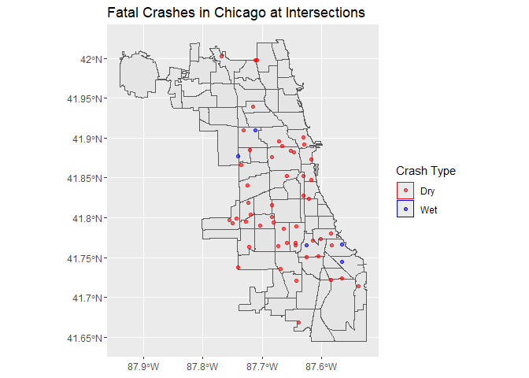

Crashes in the City of Chicago
================
Paul Alves
November 16, 2018

The topic of investigation are intersection crashes in the city of Chicago. The idea was to try and see which areas may have large clusters of crashes. The city of Chicago provides a comprehensive data set on crashes including locations and conditions regarding the crash such as where it occurred or how many fatalities took place. I decided to look at crashes involving intersections. I also decided to look at incidents where the road was either wet or dry. This was to determine if certain roadways were more dangerous during wet weather rather than during dry weather.

    ## Reading layer `Boundaries' from data source `F:\dev\cfss\hw07\data\Boundaries.geojson' using driver `GeoJSON'
    ## Simple feature collection with 77 features and 9 fields
    ## geometry type:  MULTIPOLYGON
    ## dimension:      XY
    ## bbox:           xmin: -87.94011 ymin: 41.64454 xmax: -87.52414 ymax: 42.02304
    ## epsg (SRID):    4326
    ## proj4string:    +proj=longlat +datum=WGS84 +no_defs

    ## Reading layer `Crashes' from data source `F:\dev\cfss\hw07\data\Crashes.geojson' using driver `GeoJSON'
    ## replacing null geometries with empty geometries
    ## Simple feature collection with 240916 features and 55 fields (with 958 geometries empty)
    ## geometry type:  POINT
    ## dimension:      XY
    ## bbox:           xmin: -87.92504 ymin: 41.64467 xmax: -87.52459 ymax: 42.02278
    ## epsg (SRID):    4326
    ## proj4string:    +proj=longlat +datum=WGS84 +no_defs

The map is interesting in its production. First, no crashes occurred in the same place twice. The location of the crashes do not seem to be centered in one certain area. There are about three crashes clustered near the Garfield Ridge neighborhood. There were only five crashes where the road was wet. Most of the data was generally on the south side of Chicago. The downtown area did not have many crashes available as well. West Englewood and Englewood tended to have higher amounts of intersection crashes as well. The overall general conclusion that can be drawn from this data is that the southern side of the city needs to invest more in traffic control systems. These systems may fail more often or are simply under placed in the southern areas. The lack of crashes during wet road conditions is surprising. More information is needed to determine if the data was during a dry year or if less accidents occur at intersections in wet weather.
